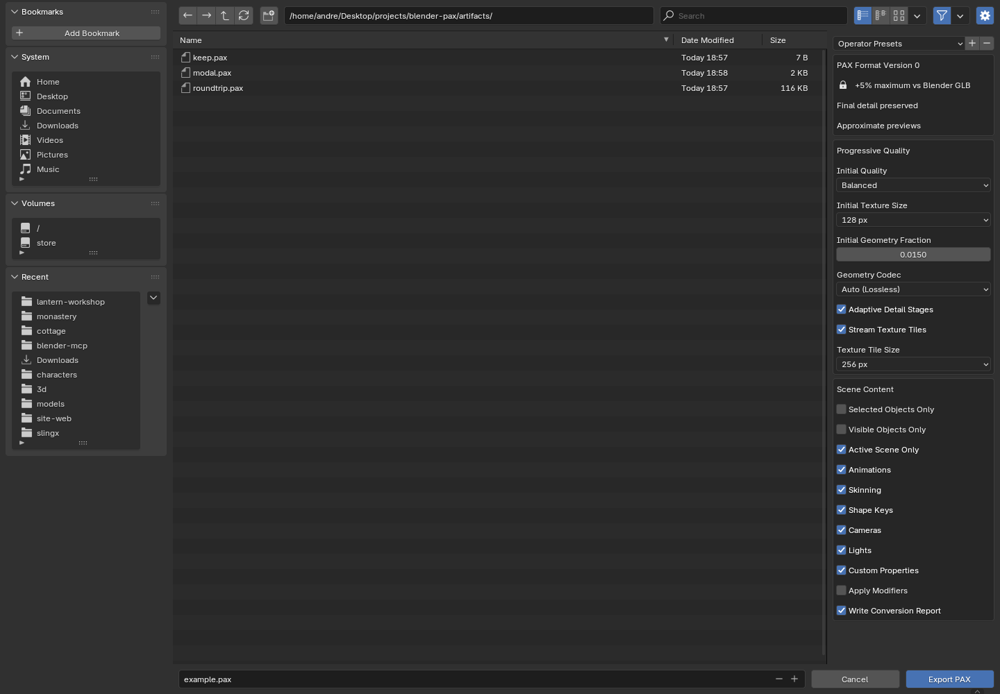

# blender-pax

Import and export **PAX version 0** in Blender, with progressive geometry and
texture settings directly in the export browser.

[Download the add-on](https://github.com/AndreBaltazar8/blender-pax/releases/latest)
· [Format specification](https://github.com/AndreBaltazar8/spec-pax)
· [Converter](https://github.com/AndreBaltazar8/convert-pax)
· [Three.js loader and samples](https://github.com/AndreBaltazar8/three-pax)



## Install

1. Install **Blender 4.5 or newer**, **Node.js 24 or newer** (including npm), and **Git**.
2. Download `blender_pax-0.1.0.zip` from Releases. In Blender, open
   **Edit → Preferences → Add-ons → menu → Install from Disk**, select the ZIP,
   and enable **PAX Import / Export**.
3. Expand the add-on preferences and click **Install / Repair PAX Runtime**.
   This downloads the pinned converter and native codecs into Blender's user
   scripts directory, outside the extension installation. If Node or npm is not
   on Blender's PATH, select its executable in these preferences first.
4. Use **File → Export → Progressive Asset (.pax)** or
   **File → Import → Progressive Asset (.pax)**.

Setup requires network access. Import and export work offline after setup.
The add-on does not download dependencies automatically when opening an asset.
Linux with Blender 4.5.3 is tested; other platforms are not yet verified.
The add-on version (`0.1.0`) and file format version (`0`) are separate.

## Export settings

Every custom setting exposed by the current convert-pax converter is available:

| Export control | Converter setting | Default |
| --- | --- | --- |
| Initial Quality: Fast / Balanced / Sharp | `initialQuality` | Balanced |
| Initial Texture Size: 16–1024 px | `textureBaseSize` | 128 px |
| Initial Geometry Fraction | `geometryBaseRatio` | 0.015 (1.5%) |
| Adaptive Detail Stages | `adaptive` | Enabled |
| Geometry Codec: Auto / Plain Gzip | `geometryCodec` | Auto |
| Stream Texture Tiles | `textureTiles` | Enabled |
| Texture Tile Size: 128 / 256 / 512 px | `tileSize` | 256 px |

These control the initial preview and refinement layout. The converter may retain
more geometry to preserve valid topology and may choose fewer stages or another
texture layout to fit the budget. They are not a fixed number of LODs.

The **5% maximum overhead is enforced** against the temporary GLB produced by
Blender, not against the `.blend` file. The optional `.stats.json` report contains
size measurements, chosen stages/codecs, settings, and fidelity metadata. The
report is a separate file and is not counted as part of the PAX asset.

Scene controls include selection, visibility, active scene, animations, skinning,
shape keys, cameras, lights, custom properties, and modifiers. Apply Modifiers
and Shape Keys cannot be enabled together because of Blender's glTF exporter
constraint. The export browser supports operator presets.

## How it works and what round-trips

Export uses Blender's glTF exporter to produce a temporary GLB, then the canonical,
pinned **convert-pax** implementation produces a streamable `.pax` asset. Import
validates the PAX packet checksums/directory, reconstructs all geometry and textures,
and passes a self-contained GLB to Blender's glTF importer. Imported textures are
packed so they remain usable after temporary files are removed.

The external conversion runs as a cancellable background process. Press Escape
while it runs to cancel. Blender's own glTF export/import stages still run on its
main thread. A failed conversion does not replace an existing output PAX file.

PAX reconstruction preserves the final encoded glTF attribute data and topology;
previews are approximate. This is **not a lossless `.blend` archive**. Blender's
glTF exporter determines how modifiers, materials, procedural textures, custom
nodes and animation authoring data become glTF, and its importer determines how
those return to Blender. Bake unsupported procedural materials before export.
KTX2 textures are decoded to their final RGBA8 pixels for Blender; the original
compressed texture bitstream is not preserved by a Blender re-export.

Built-in PAX geometry refinements, lattice/tiled image refinements, source images,
and KTX2 mip streams are reconstructed. Scene and glTF extension data are retained
in the intermediate GLB, but only extensions supported by Blender's glTF importer
become native Blender content. Required unsupported extensions may cause Blender
to reject the import. Interactivity graphs and Gaussian splats do not gain native
Blender behavior from this add-on. Unknown extension refinement packet types fail
explicitly rather than producing an incomplete model. Import waits for full detail;
this release does not progressively render inside the Blender viewport.

## Development and verification

```sh
npm ci --prefix addon/blender_pax/runtime
node --test addon/blender_pax/runtime/decode.test.mjs
blender --background --factory-startup --python-exit-code 1 --python tests/blender_roundtrip.py
python3 scripts/package.py
blender --factory-startup --command extension validate dist/blender_pax-0.1.0.zip
```

The Blender round-trip test covers a textured, skinned mesh with animated shape
keys and a bone, UVs, a camera, a light and custom properties, plus the file-size
cap and protection of an existing destination. Decoder tests compare complete
attribute/index data and pixels, including KTX2 mips, both texture layouts, shared
meshes, instancing, skin matrices and animations, and reject corrupted packets.
`tests/blender_ui.py` exercises the actual export browser and captures its panel;
it requires a display (an Xvfb display works on Linux).
`tests/blender_modal.py` verifies asynchronous export and import in a live Blender
window; run it with `blender --factory-startup --python tests/blender_modal.py`.

For source-only development, put `addon` on Blender's Python path, import
`blender_pax`, and call `register()`. Tests use `PAX_RUNTIME_ROOT` to point at the
local runtime. Normal installations copy runtime source to
`SCRIPTS/pax_runtime/0.1.0` within Blender's user resources.

## License

GPL-3.0-or-later. See [LICENSE](LICENSE) and
[third-party notices](THIRD_PARTY_NOTICES.md).
